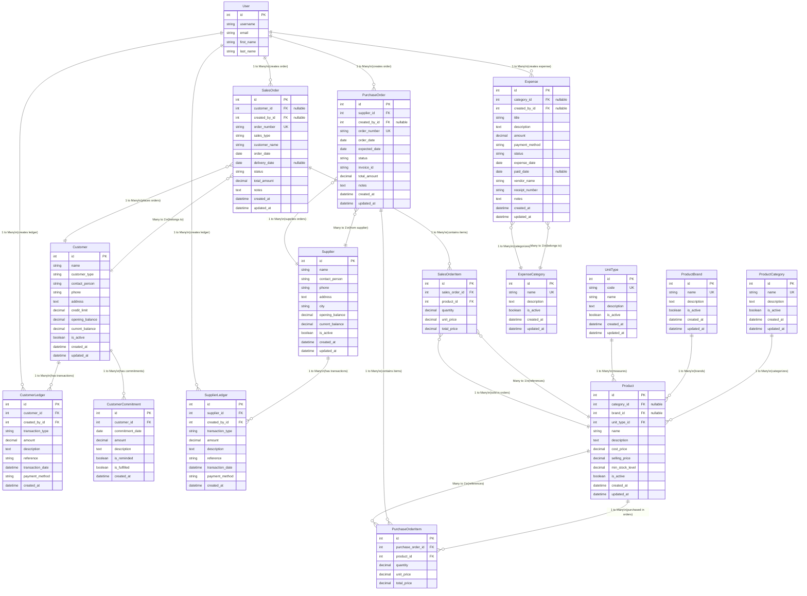

# Entity Relationship Diagram (ERD)
## Django ERP System - Complete Database Schema

> **Note**: This ERD reflects the current system status with real-time inventory calculation. No Stock or StockAlert models exist.



## Relationship Diagram with Arrows

The Mermaid diagram above shows all relationships with arrows indicating:
- **`||--o{`**: One-to-Many (Parent has many children)
- **`}o--||`**: Many-to-One (Children belong to one parent)
- **Arrow direction**: Points from parent to child

### Visual Relationship Flow:

```
USER (Creator)
  ├─→ CustomerLedger (creates)
  ├─→ SupplierLedger (creates)
  ├─→ SalesOrder (creates)
  ├─→ PurchaseOrder (creates)
  └─→ Expense (creates)

CUSTOMER (Master)
  ├─→ CustomerLedger (has transactions)
  ├─→ CustomerCommitment (has commitments)
  └─→ SalesOrder (places orders)

SUPPLIER (Master)
  ├─→ SupplierLedger (has transactions)
  └─→ PurchaseOrder (supplies orders)

PRODUCT (Master)
  ←─ ProductCategory (categorizes)
  ←─ ProductBrand (brands)
  ←─ UnitType (measures)
  ├─→ SalesOrderItem (sold in orders)
  └─→ PurchaseOrderItem (purchased in orders)

SALESORDER (Header)
  ←─ Customer (belongs to)
  ├─→ SalesOrderItem (contains items)
  └─ SalesOrderItem → Product (references)

PURCHASEORDER (Header)
  ←─ Supplier (from supplier)
  ├─→ PurchaseOrderItem (contains items)
  └─ PurchaseOrderItem → Product (references)

EXPENSE
  ←─ ExpenseCategory (belongs to)
  ←─ User (created by)
```

## Key Relationships

### Customer Module
- **Customer** → **CustomerLedger**: One-to-Many (Customer has multiple ledger entries)
- **Customer** → **CustomerCommitment**: One-to-Many (Customer has multiple commitments)
- **Customer** → **SalesOrder**: One-to-Many (Customer places multiple orders)
- **CustomerLedger** → **User**: Many-to-One (Ledger entries created by users)

### Supplier Module
- **Supplier** → **SupplierLedger**: One-to-Many (Supplier has multiple ledger entries)
- **Supplier** → **PurchaseOrder**: One-to-Many (Supplier fulfills multiple orders)
- **SupplierLedger** → **User**: Many-to-One (Ledger entries created by users)

### Stock Module (Real-Time Inventory)
- **ProductCategory** → **Product**: One-to-Many (Category has multiple products)
- **ProductBrand** → **Product**: One-to-Many (Brand has multiple products)
- **UnitType** → **Product**: One-to-Many (Unit type used by multiple products)
- **Product** → **SalesOrderItem**: One-to-Many (Product sold in multiple orders)
- **Product** → **PurchaseOrderItem**: One-to-Many (Product purchased in multiple orders)

**⚠️ Important**: No `Stock` model exists. Inventory is calculated in real-time:
```
Current Stock = SUM(PurchaseOrderItem.quantity WHERE PurchaseOrder.status = 'goods-received')
               - SUM(SalesOrderItem.quantity WHERE SalesOrder.status = 'delivered')
```

### Sales Module
- **SalesOrder** → **SalesOrderItem**: One-to-Many (Order contains multiple items)
- **SalesOrder** → **Customer**: Many-to-One (Order belongs to a customer, nullable for instant sales)
- **SalesOrderItem** → **Product**: Many-to-One (Item references a product)
- **SalesOrder** → **User**: Many-to-One (Order created by a user)

### Purchase Module
- **PurchaseOrder** → **PurchaseOrderItem**: One-to-Many (Order contains multiple items)
- **PurchaseOrder** → **Supplier**: Many-to-One (Order from a supplier)
- **PurchaseOrderItem** → **Product**: Many-to-One (Item references a product)
- **PurchaseOrder** → **User**: Many-to-One (Order created by a user)

### Expense Module
- **ExpenseCategory** → **Expense**: One-to-Many (Category has multiple expenses)
- **Expense** → **User**: Many-to-One (Expense created by a user)

## Inventory Calculation Flow

### When Purchase Order is Received (`status = 'goods-received'`)
```
PurchaseOrder.status = 'goods-received'
→ Inventory Increases
→ Product.get_realtime_quantity() includes this purchase
```

### When Sales Order is Delivered (`status = 'delivered'`)
```
SalesOrder.status = 'delivered'
→ Inventory Decreases
→ Product.get_realtime_quantity() excludes this sale
```

### Stock Alert Calculation
- Alerts are calculated dynamically using `get_low_stock_products()` function
- Condition: `current_quantity ≤ min_stock_level AND min_stock_level > 0`
- No database storage - computed in real-time

## Removed Models
The following models were removed in favor of real-time calculation:
- ❌ `Stock` - Removed (inventory calculated from transactions)
- ❌ `StockAlert` - Removed (alerts calculated dynamically)
- ❌ `StockAdjustment` - Removed (use purchase/sales orders for adjustments)
- ❌ `StockMovement` - Never existed in current system

## Indexes

### Product
- `name`, `category`, `brand`, `is_active`, `selling_price`

### Customer
- `name`, `customer_type`, `is_active`, `current_balance`

### SalesOrder
- `order_date`, `status`, `customer`, `sales_type`, `created_at`

### SalesOrderItem
- `sales_order`, `product`

### PurchaseOrder
- Standard Django indexes

## Foreign Key Constraints
- **CASCADE**: Deleting a parent deletes children (e.g., Customer → CustomerLedger)
- **SET_NULL**: Deleting a parent sets FK to NULL (e.g., ProductCategory → Product)
- **PROTECT**: Prevents deletion if children exist (e.g., UnitType → Product)

